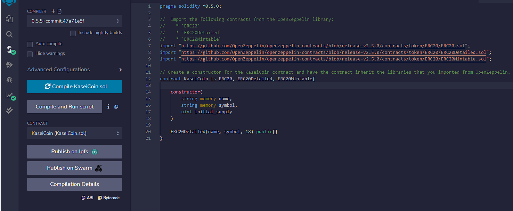
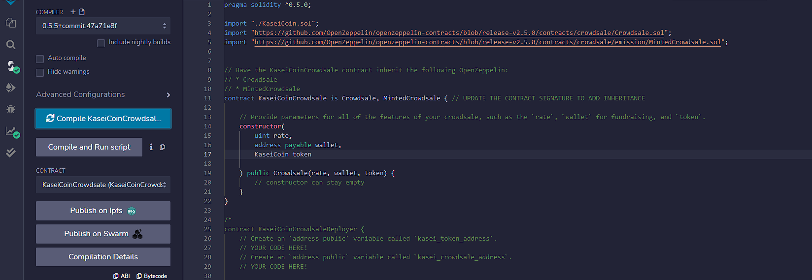
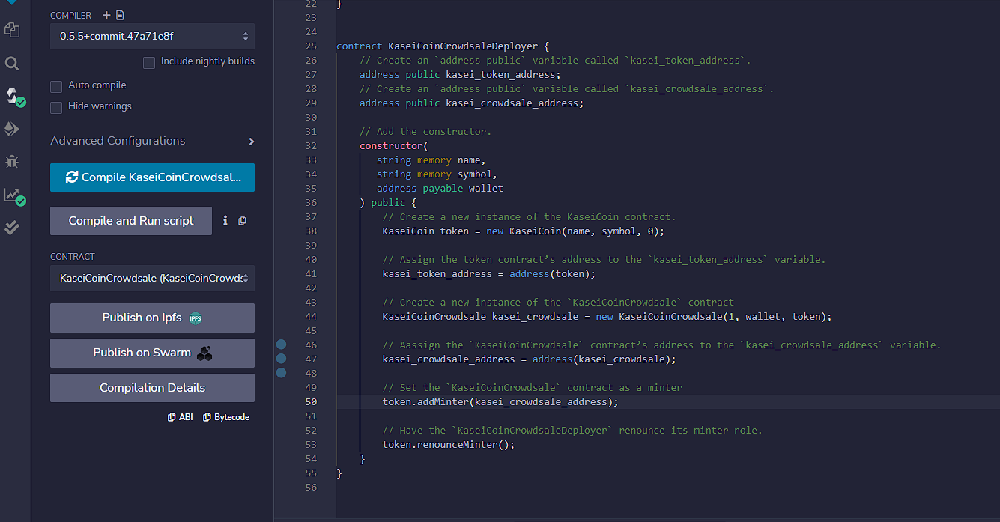
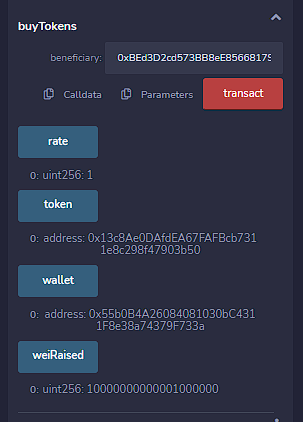
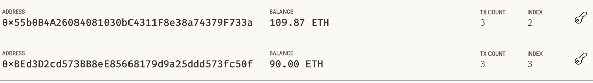

# KaseiCoin and Token Creation and Transaction

## This assignment is to create three contracts and test them to make sure it could be used on Mars. 
- KaseiCoin (KaseiCoin token contract to do multifunction of mint, transfer, balance etc...)
- KaseiCoinCrowdsale (KaseiCoin crowdsale contract can buy tokens)
- KaseiCoinCrowdsaleDeployer (KaseiCoin deployer contract is to check the addresses of crowdsale contract and token contract)

### **Here are the compilation results after running those contracts:**

Successfully compiling KaseiCoin

Successfully compiling KaseiCoinCrowdsale

Successfully compiling KaseiCoinCrowdsaleDeployer

### **Here are the execution results after creating those contracts:**

**The first step is to deploy deployer contract to check the crowdsale address and token address:**

Please see below video and screenshot of this execuation. Below screenshot list the addresses of both token and crowdsale.

https://recordit.co/J9XnEQhvzb

**The second step is to deploy crowdsale contract for the purpose of buying tokens.**

Here is the video of how I deploy contract KaseiCoinCrowdsale. Below picture display the result of deploying contract KaseiCoinCrowdsale.

https://recordit.co/N6hOGzClGm

**The last step is to deploy KaseiCoin token contract for the purpose of making all transaction including transfering and checking balance.**

Here is the vidoe of how I deploy contract KaseiCoin. Below picture display the result of deploying contract KaseiCoin.

https://recordit.co/A8LAUtc9kM

**Here is an example of a transaction to buy 1,000,000 wei tokens.**

https://recordit.co/CfF52jfEG1

**Here is an another transaction to transfer 10 ETH from a wallet to owner's wallet.**

https://recordit.co/SYXxzYrN3c

Below picture shows the total balance from Remix after completing those 2 transactions.

Below picture is to display total balance from Ganache of those 2 wallets after buying tokens and transfering 10 ETH.

